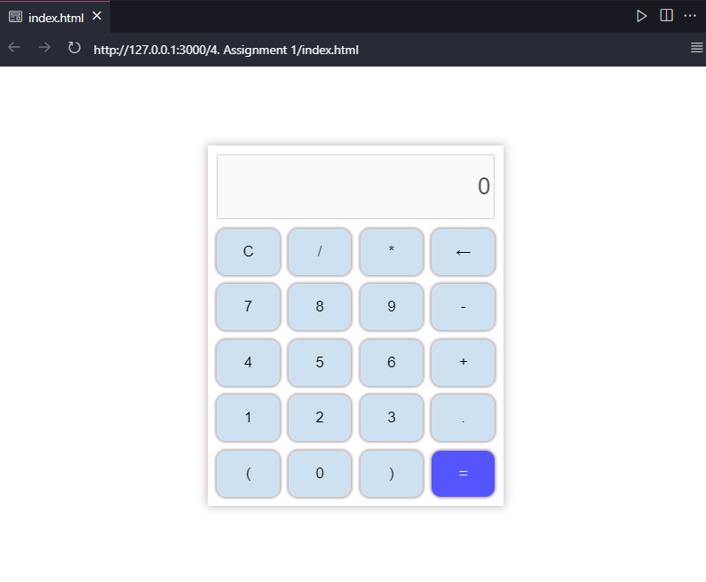

<div align="center">

<h1>Calculator Sederhana</h1>

</div>


#### Membuat caculator sederhana dengan HTML, CSS, dan JavaScript.

Hasil Akhir:

<div align="center" width="100%">

</div>

<br/>

## HTML

Mengimpor library javascript math.js untuk kalkulasi otomatis hasil dari string perhitungan matematika.

```html
<script
src="https://cdnjs.cloudflare.com/ajax/libs/mathjs/10.6.4/math.js"
integrity="sha512-BbVEDjbqdN3Eow8+empLMrJlxXRj5nEitiCAK5A1pUr66+jLVejo3PmjIaucRnjlB0P9R3rBUs3g5jXc8ti+fQ=="
crossorigin="anonymous"
referrerpolicy="no-referrer"
></script>
<script
src="https://cdnjs.cloudflare.com/ajax/libs/mathjs/10.6.4/math.min.js"
integrity="sha512-iphNRh6dPbeuPGIrQbCdbBF/qcqadKWLa35YPVfMZMHBSI6PLJh1om2xCTWhpVpmUyb4IvVS9iYnnYMkleVXLA=="
crossorigin="anonymous"
referrerpolicy="no-referrer"
></script>
```

Tag HTML input dengan dibawah, berfungsi untuk menampilkan input perhitungan matematika dan menampilkan hasil perhitungan matematika.

```html
<input id="display" type="text" value="0" disabled>
```

<br/>

### CSS

Pada kode css dibawah, container dari tombol menggunakan grid untuk mengatur jumlah kolom dan jarak antar kolom.

```css
.buttons-container {
  display: grid;
  grid-template-columns: 1fr 1fr 1fr 1fr;
  gap: 10px;
  margin-top: 10px;
}
```

<br/>

### JavaScript

Menangkap dom element display untuk memanipulasi display.

```javascript
let display = document.getElementById("display");
```

Menangkap semua element tombol hingga menghasilkan array element object.

```javascript
let buttons = Array.from(document.getElementsByClassName("button"));
```

Menambahkan event listener ke semua tombol.

```javascript
buttons.map((button) => {
  button.addEventListener("click", (e) => {
    switch (e.target.innerText) {
      case "C":
        clear();
        break;
      case "=":
        try {
          solve();
        } catch {
          display.value = "Error";
        }
        break;
      case "←":
        deleteDisplay();
        break;
      default:
        if (display.value === "0") {
          display.value = e.target.innerText;
        } else {
          display.value += e.target.innerText;
        }
    }
  });
});
```

Fungsi untuk mengkalkulasi hasil perhitungan matematika.

```javascript
function solve() {
  let x = display.value;
  let y = math.evaluate(x);
  display.value = y;
}
```

Fungsi untuk event listener input dari keyboard.

```javascript
function listenForKeyPress() {
  // add document event listener for all key presses
  document.addEventListener("keyup", (e) => {
    if (
      e.key == "0" ||
      e.key == "1" ||
      e.key == "2" ||
      e.key == "3" ||
      e.key == "4" ||
      e.key == "5" ||
      e.key == "6" ||
      e.key == "7" ||
      e.key == "8" ||
      e.key == "9" ||
      e.key == "+" ||
      e.key == "-" ||
      e.key == "*" ||
      e.key == "/"
    ) {
      if (document.activeElement !== display) {
        // focus element
        display.focus();
        // focus value
        if (display.value === "0") {
          display.value = e.key;
        } else {
          display.value += e.key;
        }
      }
    }

    if (e.key == "Enter") {
      try {
        solve();
      } catch {
        display.value = "Error";
      }
    }

    if (e.key == "Backspace") {
      delCalculation();
    }
  });
}
```